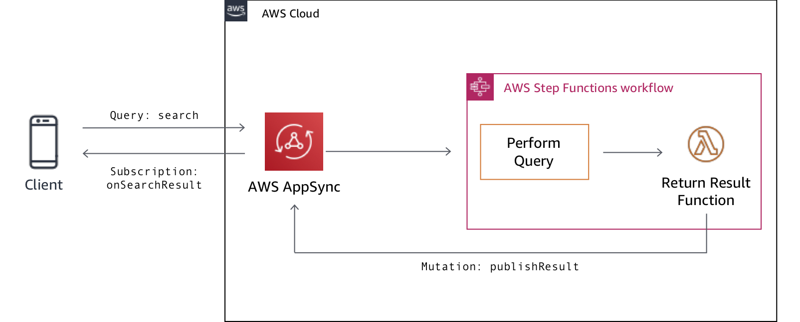
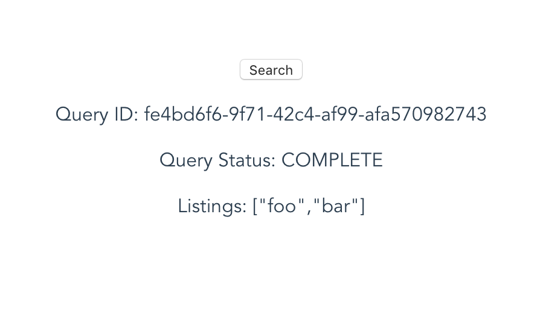

## AWS Appsync Long Query

> Invoke AWS services directly from AWS AppSync via extended HTTP data source support.

AWS AppSync has been extended to support directly calling AWS services via HTTP data sources. AppSync will sign requests using the Signature Version 4 process to authorize requests via AWS IAM. This means you can now call a broad array of AWS services without the need to write an intermediary Lambda function. For example, you could start execution of an AWS Step Functions state machine, retrieve a secret from AWS Secrets Manager, or list available GraphQL APIs from AppSync itself directly from an AppSync resolver.

In this example, we start execution of an AWS Step Function state machine directly from AppSync to demonstrate invoking a long-running query that requires more than the 30-second maximum timeout allowed by AppSync. The state machine executes a one-minute wait before returning a fake result.



More information can be found in the accompanying blog post.

## Getting Started

To get started, clone this repository. The repository contains an [AWS SAM Template](https://docs.aws.amazon.com/serverless-application-model/latest/developerguide/what-is-sam.html) template, sample client application, and source code to deploy and run the sample.

### Prerequisites

To run the sample, you will need to:

1. Select an AWS region that offers AWS AppSync (currently N. Virginia, Ohio, Oregon, Ireland, Frankfurt, London, Singapore, Tokyo, Sydney, Seoul, and Mumbai).
2. [Install the AWS SAM CLI](https://docs.aws.amazon.com/serverless-application-model/latest/developerguide/serverless-sam-cli-install.html).
3. If you would like to run the sample client, you will need to [install Vue.js](https://vuejs.org/v2/guide/installation.html).

## Deployment

We will use AWS SAM to deploy cloud resources:

``` bash
# install node modules
$ cd result && npm install & cd ..

# select a unique bucket name
$ aws s3 mb s3://<UNIQUE_BUCKET_NAME>

# package for deployment
$ sam package --output-template-file packaged.yaml \
              --s3-bucket <UNIQUE_BUCKET_NAME>

# deploy cloud resources
$ sam deploy --template-file packaged.yaml \
             --stack-name appsync-long-query \
             --capabilities CAPABILITY_NAMED_IAM
```

Once deployment is finished, we can collect a few items to configure the sample client application. Open the file `client/src/aws-config.js` in your favorite text editor. Set the value of `aws_appsync_region` to the region you selected (e.g. N. Virginia = us-east-2). Set the other values by retrieving output data from the SAM stack:

``` bash
# aws_appsync_graphqlEndpoint
$ aws cloudformation describe-stacks --stack-name appsync-long-query \
             --query 'Stacks[0].Outputs[?OutputKey==`ApiEndpoint`].OutputValue'

# aws_appsync_apiKey
$ aws cloudformation describe-stacks --stack-name appsync-long-query \
             --query 'Stacks[0].Outputs[?OutputKey==`ApiKey`].OutputValue'
```

After saving your changes, start the sample Vue application:

``` bash
$ cd client && npm install
$ npm run serve
```

Open your browser and navigate to http://localhost:8080. Click the "Search" button. View the initial response from your GraphQL API, which will automatically update the final result after approximately one minute. Use your browser's developer tools to review the Console and Network requests.



## CLeaning Up

Once finished, feel free to clean-up the sample code:

``` bash
$ aws cloudformation delete-stack \
             --stack-name appsync-long-query

$ aws s3 rm s3://<UNIQUE_BUCKET_NAME>
```

Thanks!

## License Summary

This sample code is made available under a modified MIT license. See the LICENSE file.
